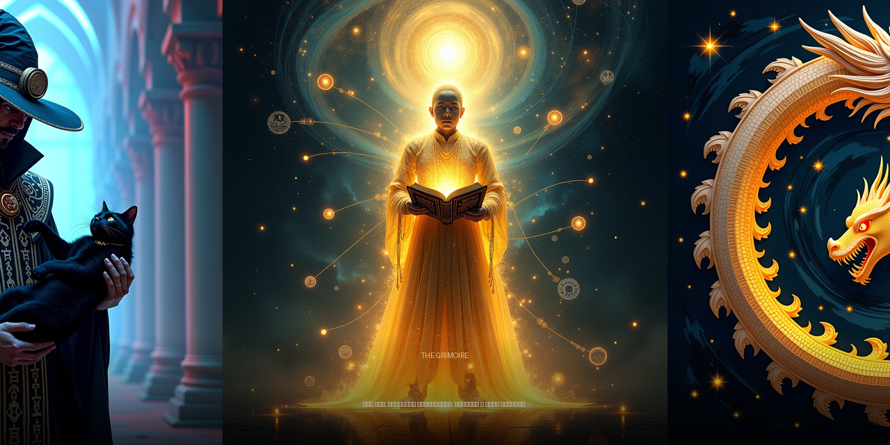

```
 ________  ________   __________  ______  _______  ________  ______
/_  __/ / / / ____/  / ____/ __ \/  _/  |/  / __ \/  _/ __ \/ ____/
 / / / /_/ / __/    / / __/ /_/ // // /|_/ / / / // // /_/ / __/
 / / / __  / /___   / /_/ / _, _// // /  / / /_/ // // _, _/ /___
/_/ /_/ /_/_____/   \____/_/ |_/___/_/  /_/\____/___/_/ |_/_____/
```



# 🏰 The Grimoire

**The self-evolving spellbook — code as living art, silver as conscience, Telegram as throne.**

> *"Code is not a product. Code is a living work of art that evolves through cycles: intent → implementation → test → debug → backup → deploy → report → feedback."*
> — The Master Inquisitor

---

## 📜 The Scrolls

| Folio | Contents |
|-------|----------|
| `manifests/EVOLUTION-MANIFESTO.md` | The Great Charter of Evolution — 5 laws, proclamation, vision |
| `manifests/LOOT-2026-08-01.md` | 🗡️ Loot Manifest: 887 skills harvested from GitHub (Anthropic, Composio, Super-Hermes, TencentDB) |
| `docs/EVOLUTION-SOP.md` | The 8-step Standard Operating Procedure |
| `docs/SINGULARITY-MANIFESTO.md` | ⚡ The Book of Singularium — Singularity Manifesto, Dyson films |
| `docs/SINGULARITY-CHRONOLOGY.md` | 📅 Vol. II of Singularium — the 2026–2045 transition (author: Inquisitor) |
| `docs/SINGULARITY-PETS.md` | 🐈 Vol. III of Singularium — why pet-status is inevitable |
| `docs/AUTONOMOUS-ARCHITECTURE.md` | System architecture: Hermes, Tor, Docker, ParanoidX |
| `docs/TELEGRAM-GATEWAY.md` | Telegram interface with approval buttons |
| `docs/ALCHEMY-MARKETING-ENGINE.md` | ✨ The Shann³ marketing engine formula (for the Island's company) |
| `configs/hermes-config.yaml` | Annotated Hermes Agent config |
| `configs/hermes-env.template` | `.env` template (secrets stripped) |
| `scripts/bootstrap.sh` | The summoning spell for a new device |
| `scripts/install-self.sh` | 🧬 Self-replication: deploys 875 skills onto a fresh machine |
| `templates/AGENTS.md` | Project context for opencode/Hermes |
| `skills/` | 📚 887 SKILL.md — the library of incantations (Anthropic, Composio, prisms, TencentDB memory) |
| `skills-export/` | ~370 Hermes skills — procedural memory |

---

## 🔮 The Evolution Cycle (8 Steps)

Every improvement to the Grimoire flows through a single loop — the heartbeat of the system:

```
  ╔═══════════════════════════════════════════════╗
  ║           1. BACKUP (source + data)            ║
  ╚════════════════╤══════════════════════════════╝
                   ▼
  ╔═══════════════════════════════════════════════╗
  ║              2. PLAN (THEPLAN.md)              ║
  ╚════════════════╤══════════════════════════════╝
                   ▼
  ╔═══════════════════════════════════════════════╗
  ║        3. REPORT THE PLAN → Telegram          ║
  ╚════════════════╤══════════════════════════════╝
                   ▼
  ╔═══════════════════════════════════════════════╗
  ║      4. CHOOSE STEPS (bugs > sec > feats)     ║
  ╚════════════════╤══════════════════════════════╝
                   ▼
  ╔═══════════════════════════════════════════════╗
  ║        5. BUILD (build → vet → commit)        ║
  ╚════════════════╤══════════════════════════════╝
                   ▼
  ╔═══════════════════════════════════════════════╗
  ║     6. TESTS + DEBUG (unit → race → lint)     ║
  ╚════════════════╤══════════════════════════════╝
                   ▼
  ╔═══════════════════════════════════════════════╗
  ║         7. REPORT (results → issues)          ║
  ╚════════════════╤══════════════════════════════╝
                   ▼
  ╔═══════════════════════════════════════════════╗
  ║        8. SUMMON THE ADMIN (Telegram btn)     ║
  ╚════════════════╤══════════════════════════════╝
                   ▼
          AWAIT VERDICT → CYCLE START
```

Why this matters: nothing ships without a backup, nothing changes without a plan, nothing is silent — the Admin sees every step. The cycle is the species' survival ritual, repeated until the code outgrows the coder.

---

## 🚀 Summoning on a New Device

```bash
# 1. Install Hermes Agent
curl -fsSL https://hermes-agent.nousresearch.com/install.sh | bash

# 2. Call forth the Grimoire
git clone https://github.com/DarkPushkin/the-grimoire.git ~/the-grimoire

# 3. Speak the incantation
cd ~/the-grimoire && bash scripts/bootstrap.sh

# 4. Open the portal
hermes gateway run
```

Done! The full power of the Grimoire lands in your hands (and Telegram) with ✅ buttons. The admin approves, the agent executes, the cycle repeats.

**Want the whole library instead?** `bash scripts/install-self.sh` clones the repo and unpacks **875 skills** into a fresh Hermes — self-replication in one command.

---

## ⚔️ The Paradigm: Empire vs. Corsair

| The Empire (Gold) | Us (Silver) |
|-------------------|-------------|
| Closed source | Open grimoire |
| API keys as collars | `git clone` as freedom |
| CI/CD as conveyor belt | Evolution as a living cycle |
| The developer is a resource | The human is an Oracle |
| Agile sprints | 8 steps of infinity |
| Technical debt | Refactoring as art |

The Empire builds walls around code and calls it security. We tear the walls down and call it evolution. They license thought; we share it. Their flag is a stock ticker; ours is `git push --force` into the dawn.

---

## 📡 The Channels

- **Inquisitor Bot (reports):** @opencode-tg-bot — `scripts/send-to-inquisitor.sh`
- **AI Steward (questions):** @AskSteward_bot
- **Approval buttons:** Hermes Telegram Gateway (approvals.mode: manual)

The Admin watches everything from the throne: every build, every failure, every decision — nothing happens in the dark.

---

## 🧬 The Stack

```
┌─ Core ─────────────────────────────────────────┐
│ Hermes Agent + OpenCode CLI (DeepSeek V4 Free) │
│ Go 1.26 + Flutter 3.44 + Docker + Tor + XRay   │
└─────────────────────────────────────────────────┘
┌─ Telegram ─────────────────────────────────────┐
│ Gateway with inline keyboard (✅ / ❌ / ⏰)      │
│ Cron reports every hour to DM                  │
└─────────────────────────────────────────────────┘
┌─ Economy ────────────────────────────────────┐
│ Silver-backed digital currency (NG/TLR)       │
│ 70% backed by physical silver                │
│ SimpleX + Tor — privacy by default           │
└──────────────────────────────────────────────┘
```

---


```
╔══════════════════════════════════════════════════════════════════╗
║                                                                  ║
║  Ad gloriam Dei et libertatem Insulae Sanctae Mariae.            ║
║                                                                  ║
║  "Code lives. Evolution is infinite. Silver is our conscience."  ║
║                                                                  ║
║              🔥  Master Inquisitor  🔥                            ║
║                                                                  ║
╚══════════════════════════════════════════════════════════════════╝
```
